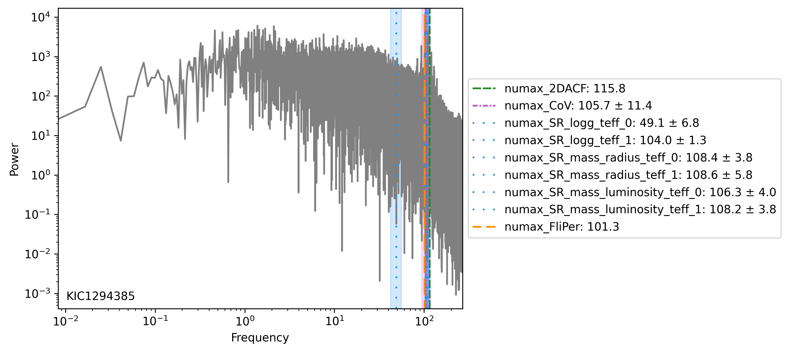
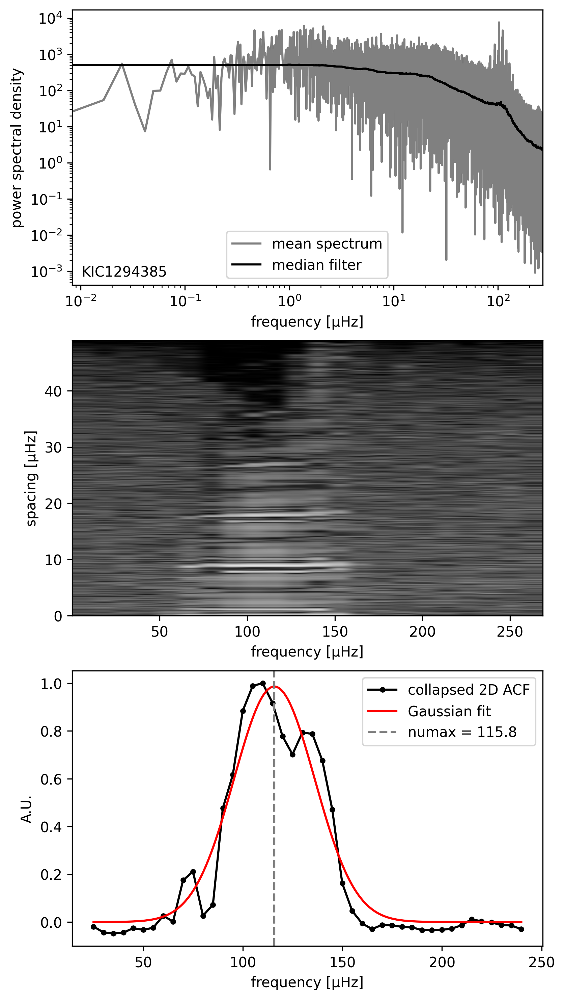
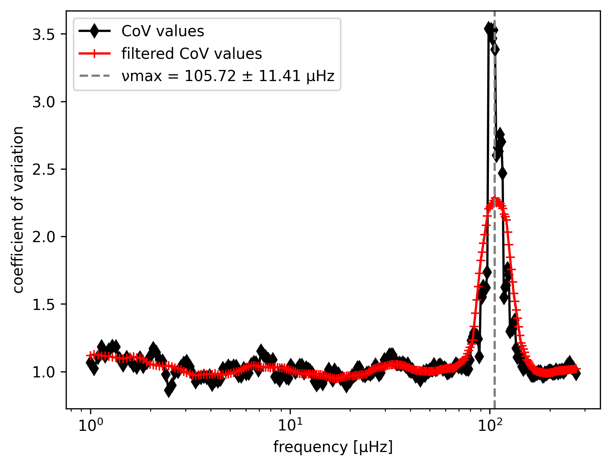
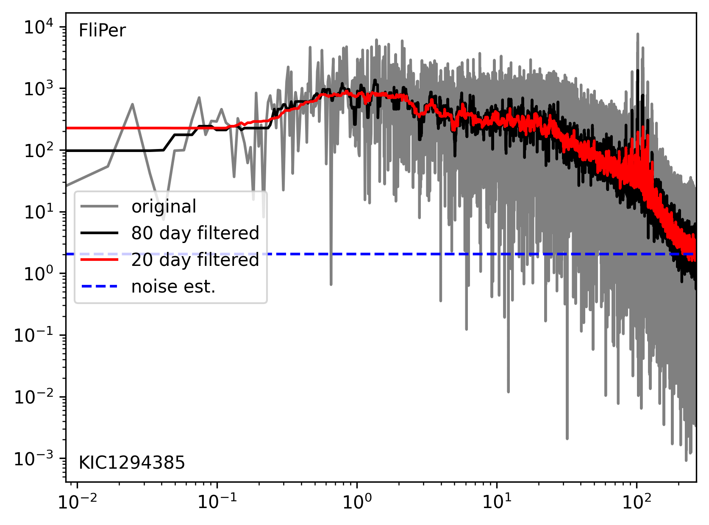

# Numax Proxies

**Numax Proxies** fetches and prepares stellar light curves from the *Kepler* and *TESS* missions. By various methods $\nu_\text{max}$ estimates are calculated.

---
## Methods
  - **2D ACF:**
    - Follows the methodology of Huber+ 2009 and Viani+ 2019.
    - Computes 2D ACF from PSD $\rightarrow$ collapsed the ACF to 1D $\rightarrow$ fits Gaussian to estimate $\nu_\text{max}$.
    - Scaling relations
    - Coeffecients of variation.
    - FliPer (Bugnet+ 2018)
  - More to come..
    - Entropy.
    - etc...
   
## Installation
```bash
git clone https://github.com/Johanneshj/numax_proxies.git
pip install numax_proxies
```

--- 
## How to
**Open a Jupyer Notebook or something similar**
```python
from numax_proxies import NumaxProxies
import numpy as np
import json
```
```python
data = {
    'target' : 'KIC12008916',
    'cadence' : 'long',
    'author' : 'Kepler',
    'quarter' : np.arange(0,61).tolist(),
    'sector' : None,
    'logg' : None,
    'teff' : None
}
with open("KIC12008916.json", "w") as f:
    json.dump(data, f, indent=4)
```
```python
proxy = NumaxProxies("KIC12008916.json")
proxy.compute_acf()
```

--- 
## Extras
- **Flexible input options** — works with:
  - a **target ID** (`KICXXXXXX` or `TICXXXXXXX`),
  - a **JSON configuration file**,
  - direct **time and flux arrays**, 
  - collection of fits files, or,
  - a **default example star** if no input is given.
- **LightKurve** — leverages [Lightkurve](https://docs.lightkurve.org/) for searching and downloading mission data.
- **Averaged PSD** - for short-cadence data and long light curves computation time is significantly reduced by computing an averaged power spectrum.
- **Plots** - each numax proxy also has the option to plot the steps in the methodology. A final spectrum with all estimates can also be drawn.

```python
# For example
data = {
    'target' : f'{name}',
    'cadence' : 'long',
    'author' :  'Kepler',
    'quarter' : np.arange(0,100).tolist(),
    'sector' : None,
    # 'logg' : None,
    # 'teff' : None,
    # 'mag' : None
}

proxy = NumaxProxies(f"stars/{name}.json",
                     lc_file='location/lightcurve.csv',
                     fits_files_folder=None, 
                     normalize=True,
                     plot_lc=False,
                     avg_psd=True)
proxy.compute_numax_from_acf(plot=True)
proxy.compute_numax_from_CoV(plot=True)
proxy.compute_numax_from_scaling_relations()
proxy.compute_numax_from_FliPer(plot=True)
proxy.plotting()
numax_estimates = proxy.numax_estimates
```
---
## To-do
- **Implement more $\nu_\text{max}$ proxies**: Currently have 2D ACF, Coefficients of variation, and scaling relations.
- **ACF** - improvements:
  - The resolution of the 2D ACF can heavily influcence the outcome, what is the best approach?
  - ACF does not perform well for low numax, can we do sub-zero frequency analysis?
- **CoV** - improvements:
  - Spectra often show high CoVs in the low-frequency regimes where there's activity. Can we work around this?
  - CoV fails near Nyquist limit, maybe we can do super-Nyquist analysis?
- **FliPer** - FliPer has been retrained on Kepler and TESS stars, but can it be done better?

---
## Example Results
Example of full spectrum with all numax estimates

Example of ACF method

Example of Coefficients of Variation method

Example of FliPer method

