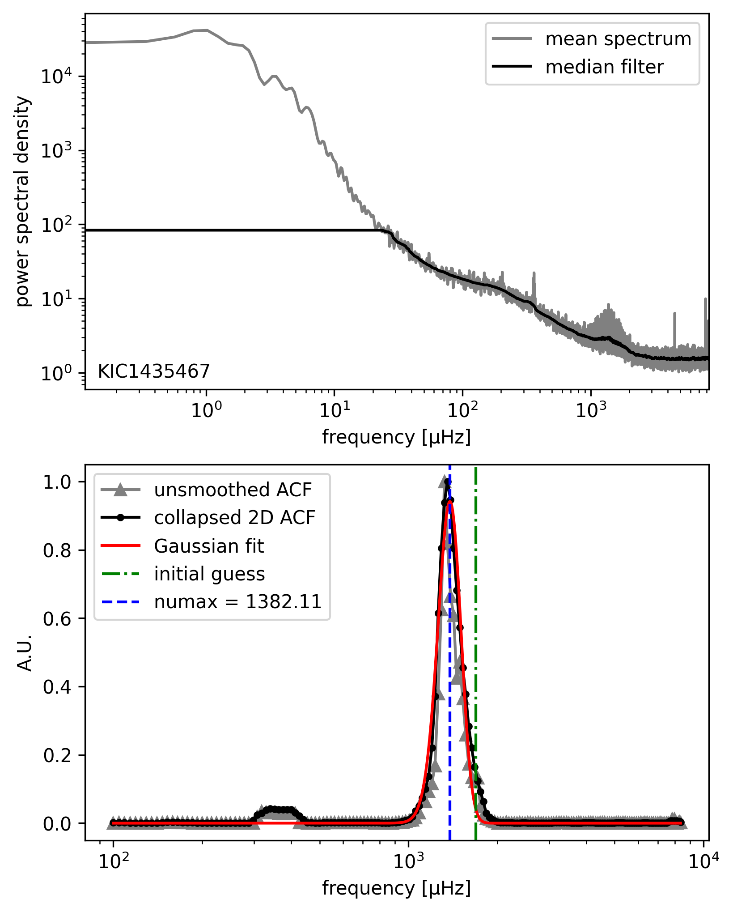

# Numax Proxies

**Numax Proxies** fetches and prepares stellar light curves from the *Kepler* and *TESS* missions. By various methods $\nu_\text{max}$ estimates are calculated.

---
## 🤓 Methods
  - **2D ACF:**
    - Follows the methodology of Huber+ 2009 and Viani+ 2019.
    - Computes 2D ACF from PSD $\rightarrow$ collapsed the ACF to 1D $\rightarrow$ fits Gaussian to estimate $\nu_\text{max}$.
  - More to come...
    - Scaling relations
    - Coeffecients of variation.
    - etc...
   
## ⚙️ Installation
```bash
git clone https://github.com/Johanneshj/numax_proxies.git
pip install numax_proxies
```

--- 
## 🌟 How to
**Open a Jupyer Notebook or something similar**
```python
from numax_proxies import NumaxProxies
import numpy as np
import json
```
```python
data = {
    'target' : 'KIC12008916',
    'cadence' : 'long',
    'author' : 'Kepler',
    'quarter' : np.arange(0,61).tolist(),
    'sector' : None,
    'logg' : None,
    'teff' : None
}
with open("KIC12008916.json", "w") as f:
    json.dump(data, f, indent=4)
```
```python
proxy = NumaxProxies("KIC12008916.json")
proxy.compute_acf()
```

--- 
## 🎁 Extras
- **Flexible input options** — works with:
  - a simple **target ID** (`KICXXXXXX` or `TICXXXXXXX`),
  - a detailed **JSON configuration file**,
  - direct **time and flux arrays**, or
  - a **default example star** if no input is given.
- **Automatic source prioritization** - selects data based on coverage and author (e.g., KASOC, Kepler, TASOC, SPOC, etc.).
- **LightKurve backend** — leverages [Lightkurve](https://docs.lightkurve.org/) for searching and downloading mission data.

---
## ⚠️ To-do
- **Implement more $\nu_\text{max}$ proxies** - coeffs of var, scaling relations, ...
- **ACF** - improvements:
  - Huber+ 2009 bins spectrum in evenly spaced log bins, Viana+ 2019 simply smooths with a window size of 10 and 100 muHz for long and short cadence data respectively. **What's the best approach?**
  - **Plotting 2D ACF map is computationally heavy** - can it be faster?
  - **ACF calculation becomes demanding for long time-series** - clever workaround?
 
---
## 📈 Example Results
Example of ACF method

