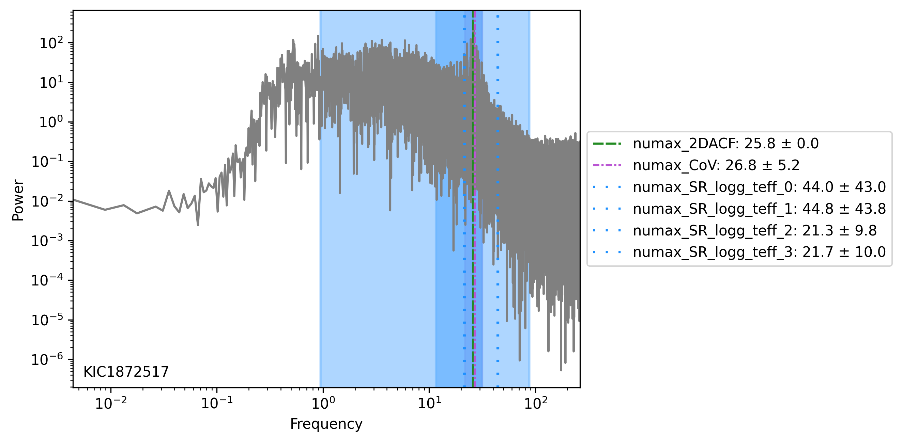
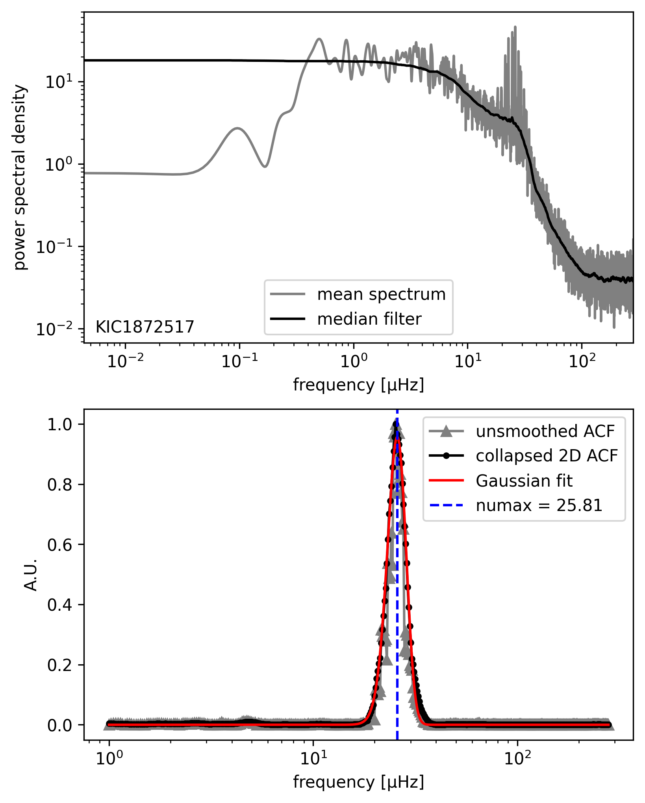

# Numax Proxies

**Numax Proxies** fetches and prepares stellar light curves from the *Kepler* and *TESS* missions. By various methods $\nu_\text{max}$ estimates are calculated.

---
## Methods

### Coefficient of Variation (CoV)
In chunks of the power-spectral density (PSD) the CoV is the ratio of the standard devation to the mean. For power spectra of pure white noise, this ratio equals unity. Examining where in the PSD the CoV is greater than 1 can be used to estimate $\nu_\text{max}$.
- From Bell+ (2019) the False-Alarm-Probability is adopted $\rightarrow$ this mitigates false detections.
- From Viani+ (2019) the log $\nu_\text{max}$ is adopted $\rightarrow$ this expands the CoV method to the entire PSD.

### Two-dimensional Autocorrelation Function (2DACF)
Calculating the auto-correlation function (ACF) in sliding bins across the PSD produces the two-dimensional ACF (2DACF) (Huber+ 2009). In the collapsed 2DACF, high values are attained around $\nu_\text{max}$ from the regular spacing of modes.
- From Viani+ (2019) the log $\nu_\text{max}$ is adopted $\rightarrow$ this expands the 2DACF method to the entire PSD.

### Scaling relations
With the option to query the Gaia database for log(g) and $T_\text{eff}$, $\nu_\text{max}$ may also be estimated from the scaling relations.

### FliPer
FliPer (Bugnet+ 2018) estimates $\nu_\text{max}$ from the power in the PSD. Powerful, **but not implemented yet!!!**
   
## Installation
```bash
git clone https://github.com/Johanneshj/numax_proxies.git
pip install numax_proxies
```
--- 
## How to
**Open a Jupyer Notebook or something similar**
```python
from numax_proxies import NumaxProxies
```
```python
# Initialize numax proxies
proxy = NumaxProxies.read_yaml('numax_proxies/stars/KIC1872517.yaml').run()

# Compute estimates
proxy.compute_numax_from_acf()
proxy.compute_numax_from_CoV()
proxy.compute_numax_from_scaling_relations()

# Plot all estimates
proxy.plotting()

# Get results
res = proxy.results
```

---
## Example Results
Example of full spectrum with all numax estimates

Example of ACF method

Example of Coefficients of Variation method

