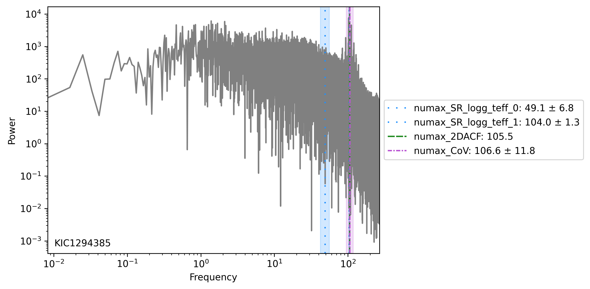
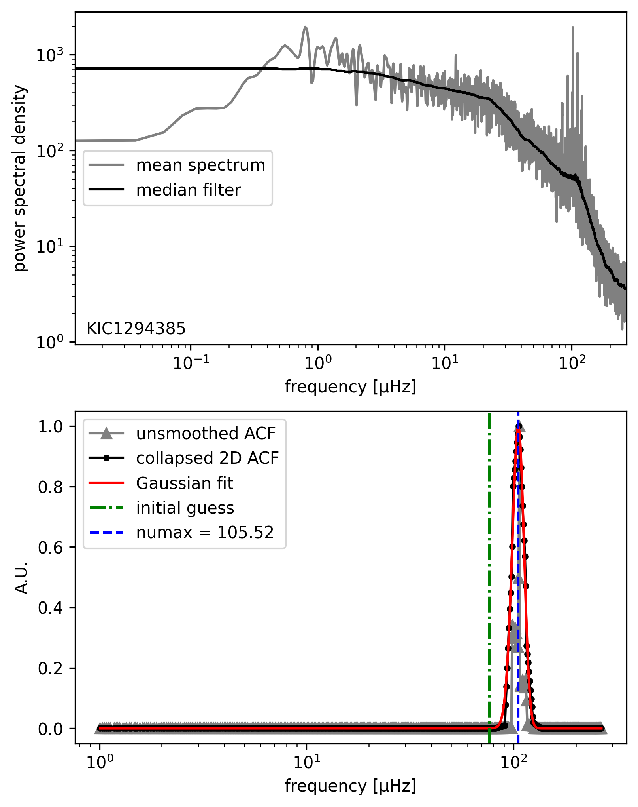
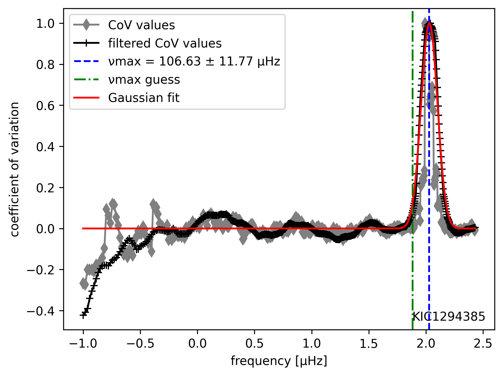
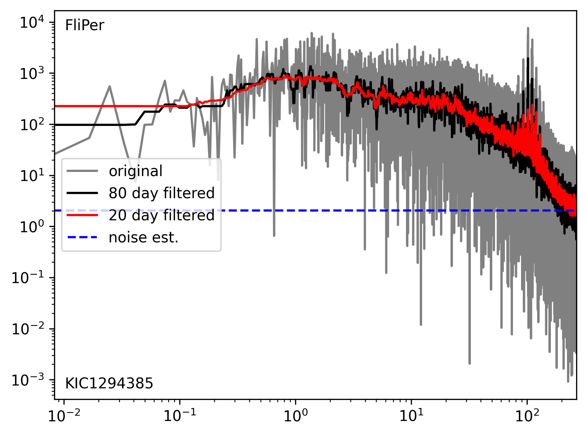

# Numax Proxies

**Numax Proxies** fetches and prepares stellar light curves from the *Kepler* and *TESS* missions. By various methods $\nu_\text{max}$ estimates are calculated.

---
## Methods

### Coefficient of Variation (CoV)
In chunks of the power-spectral density (PSD) the CoV is the ratio of the standard devation to the mean. For power spectra of pure white noise, this ratio equals unity. Examining where in the PSD the CoV is greater than 1 can be used to estimate $\nu_\text{max}$.
- From Bell+ (2019) the False-Alarm-Probability is adopted $\rightarrow$ this mitigates false detections.
- From Viani+ (2019) the $\text{log}\_\nu_\text{max}$ is adopted $\rightarrow$ this expands the CoV method to the entire PSD.

  - **2D ACF:**
    - Follows the methodology of Huber+ 2009 and Viani+ 2019.
    - Computes 2D ACF from PSD $\rightarrow$ collapsed the ACF to 1D $\rightarrow$ fits Gaussian to estimate $\nu_\text{max}$.
  - **Scaling relations**.
  - **FliPer (Bugnet+ 2018)** *(Experimental)*
  - More to come..
    - Entropy, GAU, etc...
   
## Installation
```bash
git clone https://github.com/Johanneshj/numax_proxies.git
pip install numax_proxies
```
--- 
## How to
**Open a Jupyer Notebook or something similar**
```python
from numax_proxies import NumaxProxies
```
```python
# Initialize numax proxies
proxy = NumaxProxies.read_yaml('numax_proxies/stars/KIC1872517.yaml').run()

# Compute estimates
proxy.compute_numax_from_acf()
proxy.compute_numax_from_CoV()
proxy.compute_numax_from_scaling_relations()

# Plot all estimates
proxy.plotting()

# Get results
res = proxy.results
```

--- 
## Extras
- **Flexible input options** — works with:
  - a **target ID** (`KICXXXXXX` or `TICXXXXXXX`),
  - a **JSON configuration file**,
  - direct **time and flux arrays**, 
  - collection of fits files, or,
  - a **default example star** if no input is given.
- **LightKurve** — leverages [Lightkurve](https://docs.lightkurve.org/) for searching and downloading mission data.
- **Averaged PSD** - for short-cadence data and long light curves computation time is significantly reduced by computing an averaged power spectrum.
- **Plots** - each numax proxy also has the option to plot the steps in the methodology. A final spectrum with all estimates can also be drawn.

---
## To-do
- **Implement more $\nu_\text{max}$ proxies**: Currently have 2D ACF, Coefficients of variation, and scaling relations.
- **ACF** - improvements:
  - The resolution of the 2D ACF can heavily influcence the outcome, what is the best approach?
  - ACF does not perform well for low numax, can we do sub-zero frequency analysis?
- **CoV** - improvements:
  - Spectra often show high CoVs in the low-frequency regimes where there's activity. Can we work around this?
  - CoV fails near Nyquist limit, maybe we can do super-Nyquist analysis?
- **FliPer** - FliPer has been retrained on Kepler and TESS stars, but can it be done better?

---
## Example Results
Example of full spectrum with all numax estimates

Example of ACF method

Example of Coefficients of Variation method

Example of FliPer method

